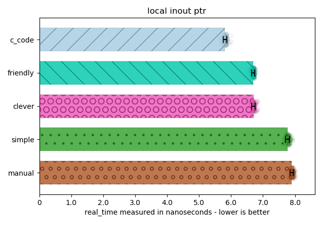
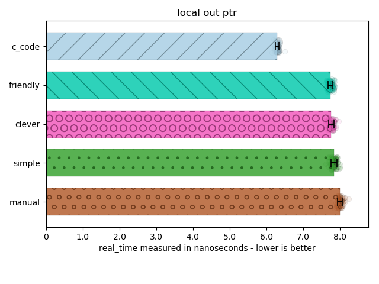
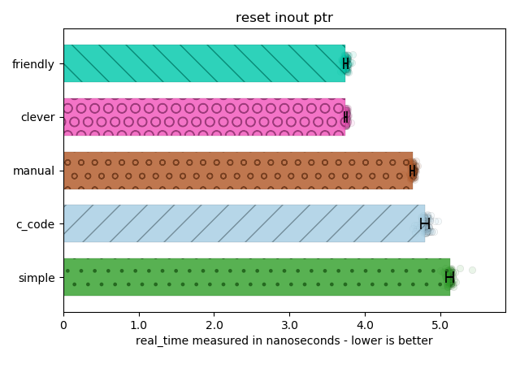
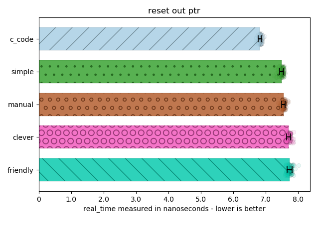
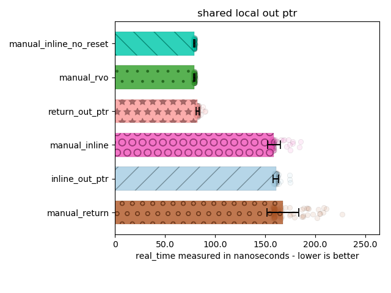
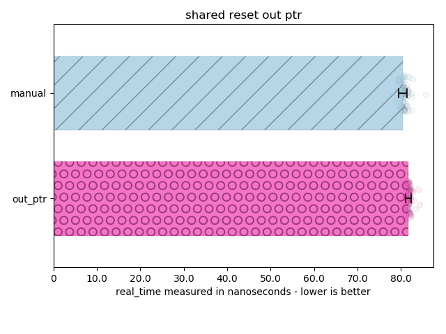

// Copyright ⓒ 2018-2021 ThePhD.
//
// Licensed under the Apache License, Version 2.0 (the "License");
// you may not use this file except in compliance with the License.
// You may obtain a copy of the License at
//
//     http://www.apache.org/licenses/LICENSE-2.0
//
// Unless required by applicable law or agreed to in writing, software
// distributed under the License is distributed on an "AS IS" BASIS,
// WITHOUT WARRANTIES OR CONDITIONS OF ANY KIND, either express or implied.
// See the License for the specific language governing permissions and
// limitations under the License.
//
//  See https://github.com/ThePhD/out_ptr/blob/master/docs/out_ptr.adoc for documentation.

[[benchmarks]]
# Benchmarks

These are the benchmarks for various situations. We do not actually allocate anything, simply provide a mockup API that pretends like it is allocating. To ensure all benchmarks are fair and that the compiler does not realize we are not allocating anything, the create/destroy calls are hidden behind a DLL, leaving the difference in the benchmarks to be a manifestation of the abstraction used to work with the target smart pointer.

The nomenclature on the titles is as follows:

* "local": smart pointer is created inline in the benched code, destructs per run.
* "reset": it means the type was constructed outside the benchmark loop and then reused.
* "shared": uses `std::shared_ptr` (if this is not present, it is using `std::unique_ptr`)

The nomenclature for the bar graphs is as follows:

* "manual": uses a smart pointer, but supplies a raw pointer to the call and then manually calls `.reset(...)`
* "c_code": written using plain C code
* "clever": a flavor of out_ptr using struct-aliasing UB to grab the private pointer sitting interally in the `unique_ptr`
* "friendly": a flavor of out_ptr that is used with a directly-copied implementation of the libstdc++/libc++/V{cpp} and directly friended, avoiding the struct-aliasing UB
* "simple": the by-the-book implementation of out_ptr consisting of a call to `.reset(...)` and `.release(...)`, naively
* "inline": the allocation and deallocation functions were left to be inlined by removing the DLL barrier
* "rvo": constructs the type directly in the return statement, triggering RVO
* "return": pointer was not constructed on the line in which it was returned, and therefore may or may not be a candidate for RVO
* "no_reset": `.reset()` is not called at all, instead opting to do the raw pointer first and then construct the value in-place after

For more clarity, feel free to https://github.com/ThePhD/out_ptr/tree/master/benchmarks[inspect the code] as you wish or even run the benchmarks.

[[benchmarks.local.inout_ptr]]
.Using a locally created, same-scope smart pointer.

[[benchmarks.local.out_ptr]]
.Using a locally created, same-scope smart pointer.

[[benchmarks.reset.inout_ptr]]
.Resetting a long-lived, out-of-scope smart pointer.

[[benchmarks.reset.out_ptr]]
.Resetting a long-lived, out-of-scope smart pointer.

[[benchmarks.local.out_ptr.shared]]
.Using a shared pointer in various fashions with ztd::out_ptr::out_ptr or other techniques.

[[benchmarks.reset.out_ptr.shared]]
.Using a locally created, same-scope smart pointer.

